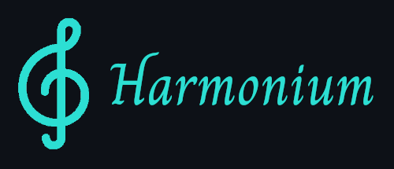
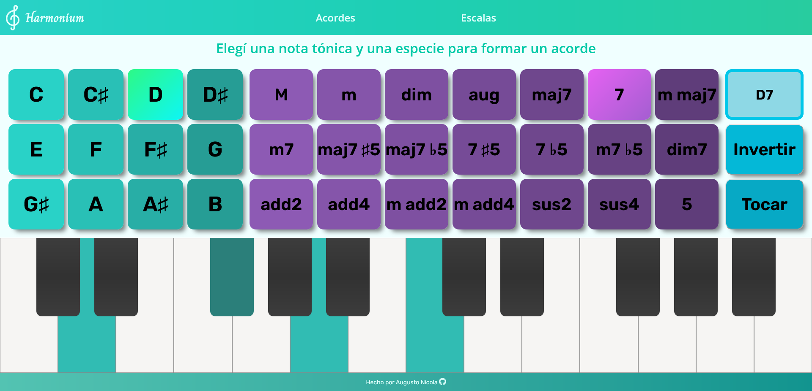

### *Virtual piano app to learn about chords and scales*

### **Live demo: https://harmonium.netlify.app/**

 

### [README en español acá :argentina: :mexico:](README.md)

 

Harmonium is a simple web app to help people learn musical concepts in a more entertaining way. It virtually simulates a piano capable of playing chords and scales in order to understand how they are constructed, as well as playing the notes. The built-in selectors allow for choosing between a wide range of common chords and scales, and there are also other useful features, such as inverting chords.

 

# Installation and Local Usage
In order to configure the development enviroment, please follow these steps:

1. **Clone the repository and move to the target directory**
	
		$ git clone https://github.com/AugustoNicola/Harmonium
		$ cd Harmonium/

2. **Install the necessary dependencies**
		
		$ npm run instalar-dependencias

That's it, the project should be ready to boot!

 

## Commands

* `npm run start`: Starts the react client at [localhost:3000](http://localhost:3000)
* `npm run instalar-dependencias`: Installs all required dependencies

 

# Contributing and License
This work is licensed under the [MIT License](https://choosealicense.com/licenses/mit/). **You are free to read, use or modify any part you want!**

Any contribution by submitting code, notifying bugs, suggestions or any other way is always greatly appreciated.

If you've liked my work, please consider leaving a star on the repo :+1: