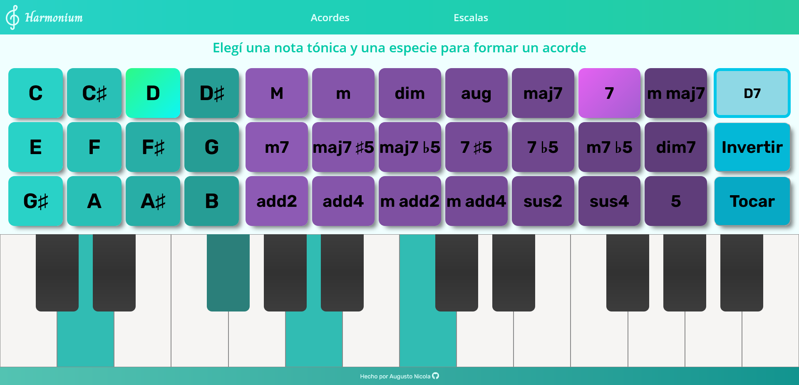

### *Piano virtual para aprender sobre escalas y acordes*

### **Versión en línea: https://harmonium.netlify.app/**

 

### [English README here :uk: :us:](README-EN.md)

 

Harmonium es una sencilla aplicación web para poder aprender conceptos musicales de una forma más entretenida. Simula un piano de forma virtual para poder visualizar acordes y escalas y entender cómo se componen, además de contar con sonido para poder oír las notas. Los selectores permiten elegir entre los acordes y escalas más comunes, y también hay otras utilidades como poder invertir los acordes.

 

# Instalación y Uso Local

Para poder configurar el entorno de desarrollo de la aplicación localmente, seguir estos pasos:

1. **Clonar el repositorio y moverse a la carpeta de destino**
	
		$ git clone https://github.com/AugustoNicola/Harmonium
		$ cd Harmonium/
	
2. **Instalar las dependencias necesarias**
		
		$ npm run instalar-dependencias

¡Listo, el proyecto debería estar configurado correctamente!

 

## Comandos

* `npm run start`: Inicia la aplicación React en [localhost:3000](http://localhost:3000)
* `npm run instalar-dependencias`: Instala todas las dependencias

 

# Contribuciones y Licencia
Este proyecto está bajo la [Licencia MIT](https://choosealicense.com/licenses/mit/). **¡Podés leer, usar o modificar el código que necesites!**

Cualquier aporte de código, notificación de errores o fallas, sugerencias o cualquier otro tipo de contribución será enormemente agradecida. 

Si te gustó mi trabajo, podés dejar un star en el repositorio :+1: